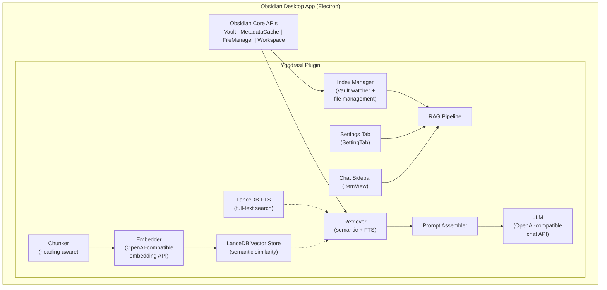

## Yggdrasil – AI Contributor Quick Guide

Purpose: Build a **Yggdrasil Obsidian plugin** that adds RAG-powered AI assistance for dungeon masters and world-builders. The plugin indexes a vault's markdown notes, performs semantic search with hybrid full-text retrieval, and provides an AI chat sidebar enhanced with retrieved context from the knowledge base.

**Phase 1 scope:** RAG pipeline (indexing, chunking, embedding, retrieval, LLM generation) + basic chat sidebar + settings panel. Graph view, D&D-specific UI, and advanced features are out of scope for Phase 1.

---

### Mandatory SDLC Workflow
All AI agents MUST follow the structured SDLC defined in [docs/sdlc.md](./sdlc.md). The workflow consists of six hard-transition stages:

1. **Requirements Elicitation** — gather requirements, define scope/boundaries, produce draft PRD in `docs/prds/`. No coding.
2. **Exploration** — explore codebase, create technical plan, expand PRD with implementation details. No coding.
3. **Validation (User Review)** — present PRD to user, incorporate feedback, finalize.
4. **Implementation** — write code strictly according to the finalized PRD.
5. **Validation (Implementation Review)** — verify implementation against PRD, run tests, fix issues.
6. **Cleanup & Refactoring** — clean up code, ensure conventions, run linters/formatters.

**Phase transitions are HARD.** Never skip, merge, or bypass stages. The agent MUST enforce this workflow even without explicit user prompting.

**Linting:** Run `npm run lint` after every code change. Fix all lint errors before proceeding. Use `npm run lint:fix` for auto-fixable issues, then manually review remaining warnings. Code MUST pass linting before any commit or PR.

---

### Architecture Essentials

**Yggdrasil is an Obsidian community plugin.** It runs inside Obsidian's Electron-based desktop app (and mobile) as a TypeScript plugin compiled to a single `main.js` bundle.



**Key architectural decisions:**
- **Single plugin, all-in-process.** No separate backend service. All RAG logic runs inside the plugin's sandboxed Electron webview.
- **LanceDB embedded.** Vector store is file-based on disk — no server process needed. Data persists in the vault's `.obsidian/plugins/yggdrasil/` directory.
- **OpenAI-compatible endpoints.** Both embedding and LLM calls go to user-configurable URLs (Ollama, LM Studio, vLLM, OpenAI, etc.). No API keys stored in code — configured via plugin settings.
- **Obsidian metadata cache as source of truth.** Headings, links, tags, and frontmatter come from `app.metadataCache`, not custom parsing. The plugin builds on top of Obsidian's existing parsing.
- **TypeScript plugin.** Compiled with Obsidian's plugin toolchain to a single `main.js`. Uses ES modules internally during development.

---

### Data Management

**Vault data (read-only):**
- All markdown files via `Vault.getFiles()` and `Vault.getMarkdownFiles()`
- File content via `Vault.cachedRead(file)` for reads
- Frontmatter via `app.fileManager.processFrontMatter(file, fn)` for writes / `getFrontMatterInfo(content)` for reads
- Metadata (headings, links, tags) via `app.metadataCache.getFileCache(file)` → `CachedMetadata`

**Plugin data (persisted):**
- Plugin settings via `this.loadData()` / `this.saveData()` (stored in `.obsidian/plugins/yggdrasil/data.json`)
- LanceDB index stored in `.obsidian/plugins/yggdrasil/index/` (auto-managed by LanceDB)
- Plugin manifest in `.obsidian/plugins/yggdrasil/manifest.json`

**Index schema (LanceDB table: `notes`):**
```typescript
interface IndexedDocument {
  id: string;           // file path + chunk offset, e.g. "campaigns/silverpeak/npcs/grommet.md:0"
  text: string;         // chunk content
  metadata: {
    source: string;     // original file path in vault
    headings: string[]; // parent heading path, e.g. ["Campaign", "Silverpeak", "NPCs"]
    sourceHeading?: string; // the heading this chunk belongs to (or undefined for frontmatter)
    wikilinks: string[]; // extracted [[links]] from this chunk
    tags: string[];     // extracted tags
    frontmatter?: Record<string, any>; // frontmatter from the source file
    entityType?: string; // derived from frontmatter type: "npc", "location", "organization", etc.
    campaign?: string;   // campaign identifier from frontmatter or path
    chunkIndex: number;  // position within the file
    wordCount: number;   // length of chunk text
  };
}
```

**Indexing strategy:**
- **Full re-index:** Triggered on first run or via command. Iterates all markdown files, chunks, embeds, and stores in LanceDB.
- **Incremental re-index:** Triggered by `Vault.on('modify')` / `Vault.on('create')` / `Vault.on('delete')` events. Only re-processes affected files.
- **Deduplication:** Delete existing embeddings for a file path before re-indexing it. Use `source` metadata as the filter key.

---

### Key External Services

| Service | Purpose | Configuration |
|---------|---------|---------------|
| **Embedding endpoint** | Generate vector embeddings for text chunks | User-configurable URL + optional API key in plugin settings. OpenAI-compatible API (e.g., `POST /v1/embeddings`). |
| **LLM endpoint** | Generate responses with retrieved context | User-configurable URL + optional API key in plugin settings. OpenAI-compatible API (e.g., `POST /v1/chat/completions`). |
| **LanceDB** | Embedded vector store for semantic search | File-based, stored in plugin data directory. No external service. |
| **Obsidian API** | Vault access, metadata, UI components | Provided by the host Obsidian app. Import from `obsidian` package. |

**Embedding API contract (OpenAI-compatible):**
```
POST {embeddingBaseUrl}/v1/embeddings
Headers: Authorization: Bearer {apiKey} (if required)
Body: { model: string, input: string | string[] }
Response: { data: [{ embedding: number[] }] }
```

**LLM API contract (OpenAI-compatible):**
```
POST {llmBaseUrl}/v1/chat/completions
Headers: Authorization: Bearer {apiKey} (if required)
Body: { model: string, messages: [{ role, content }], ... }
Response: { choices: [{ message: { content: string } }] }
```

---

### Common Development Workflows

**Building and testing:**
```bash
# Install dependencies
npm install

# Build plugin (development mode with hot reload)
npm run dev

# Build plugin (production)
npm run build

# Run unit tests
npm test

# Run tests in watch mode
npm test -- --watch
```

**Plugin development workflow:**
1. Install the [hot-reload](https://github.com/pjeby/hot-reload) Obsidian plugin for automatic reload during development.
2. Keep a test vault at `test-vault/` (or `.obsidian/plugins/yggdrasil/test-vault`) with sample markdown files for development.
3. After making changes, reload Obsidian (`Ctrl+R` or command palette) or rely on hot-reload.
4. Test manually in Obsidian: verify sidebar renders, settings save, indexing works, chat produces responses.

**Adding a new feature (follow the SDLC):**
1. Start a new PRD in `docs/prds/` following the template.
2. Go through Stages 1-3 before writing any code.
3. In Stage 4, implement against the finalized PRD.
4. Write tests for new logic (chunking, retrieval, metadata extraction).
5. Manual test in Obsidian for UI changes.

---

### Patterns & Conventions

**Plugin structure:**
```
src/
├── main.ts              # Plugin entry point (extends Plugin)
├── settings.ts          # PluginSettings interface + YggdrasilSettingTab
├── index/
│   ├── manager.ts       # IndexManager: full/incremental indexing
│   ├── chunker.ts       # Heading-aware markdown chunker
│   └── schema.ts        # TypeScript types for indexed documents
├── rag/
│   ├── embedder.ts      # Embedding client (calls OpenAI-compatible endpoint)
│   ├── retriever.ts     # Hybrid search (semantic + FTS score merging)
│   ├── prompt.ts        # Prompt assembly from retrieved chunks
│   └── llm.ts           # LLM response generation
├── store/
│   └── vector-store.ts  # LanceDB integration layer
├── ui/
│   ├── sidebar.ts       # Chat sidebar view (extends ItemView)
│   ├── chat-panel.ts    # Chat UI component (HTML/TSX)
│   └── components/      # Reusable UI components
└── utils/
    └── ...              # Helper functions
```

**Obsidian plugin conventions:**
- Extend `Plugin` class for the main entry point
- Use `this.addRibbonIcon()` for quick-access button
- Use `this.addCommand()` for palette commands
- Use `this.addSettingTab()` for settings UI
- Use `this.registerView()` for custom sidebar views
- Use `this.loadData()` / `this.saveData()` for persistent settings
- Use `Vault.on()` events for file change notifications
- Use `app.metadataCache` for parsed metadata — never re-parse markdown manually unless Obsidian's cache lacks what you need
- Use `MarkdownRenderer.render()` for rendering markdown in plugin UI

**Naming conventions:**
- Classes: PascalCase (`IndexManager`, `ChatSidebarView`)
- Interfaces: PascalCase with `I` prefix optional (`IndexedDocument`, `PluginSettings`)
- Functions/variables: camelCase (`chunkByHeadings`, `embedDocuments`)
- Constants: UPPER_SNAKE_CASE (`DEFAULT_EMBEDDING_MODEL`, `INDEX_TABLE_NAME`)
- Plugin ID: `yggdrasil` (lowercase, matches folder name)

**Error handling:**
- Always handle network errors gracefully (embedding/LLM calls can fail)
- Show user-facing notices via `new Notice(message)` for errors
- Log errors to console with context: `console.error('[Yggdrasil] indexing failed:', error)`
- Never crash Obsidian — wrap all plugin code in try/catch where appropriate

**Async patterns:**
- Use `async/await` consistently
- Show loading indicators during indexing (`new Notice('Indexing...')`)
- Debounce rapid file changes (don't re-index on every keystroke)
- Use `Workspace.onLayoutReady()` for deferred initialization

---

### Phase 1 Specifics

**In scope for Phase 1:**
1. **Plugin skeleton** — basic Obsidian plugin with ribbon icon, settings tab, and sidebar view
2. **Settings panel** — configure embedding base URL, LLM base URL, API keys (optional), model names, API key
3. **Index Manager** — full re-index of all vault markdown files, incremental re-index on file changes
4. **Chunker** — heading-aware markdown chunking using Obsidian's `CachedMetadata`
5. **Embedder** — call OpenAI-compatible embedding endpoint
6. **Vector Store** — LanceDB integration: store, delete, query embeddings with metadata filters
7. **Retriever** — hybrid search: semantic similarity + full-text score merging
8. **Prompt Assembler** — inject retrieved chunks into a system prompt template
9. **LLM Client** — call OpenAI-compatible chat endpoint with assembled prompt
10. **Chat Sidebar** — basic chat UI with message history, send button, loading state
11. **Wikilink extraction** — extract `[[links]]` from chunks and store as metadata
12. **Frontmatter extraction** — read frontmatter from source files and include in chunk metadata

**Out of scope for Phase 1 (defer to later phases):**
- Graph view / relationship visualization
- D&D-specific UI elements (character sheets, encounter trackers)
- Entity extraction / auto-tagging by LLM
- Multi-vault support
- Mobile Obsidian support (can be added later)
- Export/share functionality
- Real-time collaborative editing
- Plugin marketplace publishing

**MVP acceptance criteria for Phase 1:**
- [ ] User installs plugin, configures LLM and embedding endpoints
- [ ] User triggers "Re-index vault" command — all markdown files are indexed
- [ ] User opens chat sidebar, sends a question — receives a RAG-enhanced response
- [ ] Indexed content is retrievable by semantic similarity
- [ ] File changes trigger incremental re-index
- [ ] Settings persist across Obsidian restarts
- [ ] Basic error handling with user-visible notices

---

### Patterns & Conventions

**Chunking approach (heading-aware):**
```typescript
// Pseudo-architecture of the chunker:
// 1. Get CachedMetadata from app.metadataCache.getFileCache(file)
// 2. Extract headings array with positions
// 3. For each heading boundary, extract the section content
// 4. Create a chunk per heading section with metadata:
//    - parent headings (ancestors in the heading hierarchy)
//    - the heading text itself
//    - wikilinks found in the section
//    - tags found in the section
// 5. Also create a "frontmatter chunk" for YAML frontmatter metadata
// 6. Return array of Document objects for embedding
```

**Retrieval approach (hybrid):**
```typescript
// 1. Run semantic search: LanceDB similarity search with embedding vector
// 2. Run full-text search: LanceDB FTS query
// 3. Merge results using reciprocal rank fusion or weighted score combination
// 4. Return top-k combined results with source metadata
// 5. Pass merged results to prompt assembler
```

**Prompt assembly pattern:**
```
System prompt: "You are a helpful assistant for a dungeon master using Yggdrasil. Use the provided context to answer questions about the campaign world. Cite sources when possible."

User prompt: "Context:\n{chunk1}\n\n{chunk2}\n\n...\n\nQuestion: {userQuestion}"
```

---

### Safety Checks for AI Changes

1. **Never modify Obsidian core files.** Only work within the plugin's scope.
2. **Never hardcode API keys or URLs.** All sensitive configuration must go through plugin settings.
3. **Never make blocking/synchronous network calls.** All HTTP requests must be async.
4. **Always handle network failures.** Embedding and LLM endpoints may be unavailable — show a user-friendly notice, don't crash.
5. **Validate user input.** Sanitize strings before sending to LLM (no injection attacks via vault content).
6. **Respect vault permissions.** Only read/write files within the current vault.
7. **Test with empty vaults.** Ensure the plugin handles vaults with no markdown files gracefully.
8. **Check for existing LanceDB index.** Don't overwrite a valid index during incremental updates.
9. **Debounced file watching.** Coalesce rapid file changes into a single re-index operation.
10. **Memory limits.** Be mindful of the Electron webview memory budget — don't load entire vaults into memory at once.

---

### Fast Reference Paths

| Resource | Path |
|----------|------|
| SDLC workflow | `.github/sdlc.md` |
| PRD template | `docs/prds/_template.md` |
| Obsidian API types | `npm:obsidian` (type definitions from Obsidian package) |
| Obsidian sample plugin | `https://github.com/obsidianmd/obsidian-sample-plugin` |
| LangChain.js docs | `https://js.langchain.com/docs` |
| LanceDB JS docs | `https://lancedb.github.io/lancedb/` |
| Obsidian plugin manifest | `manifest.json` (plugin root) |
| Plugin data directory | `.obsidian/plugins/yggdrasil/` |

Keep additions minimal, consistent, and test-backed.